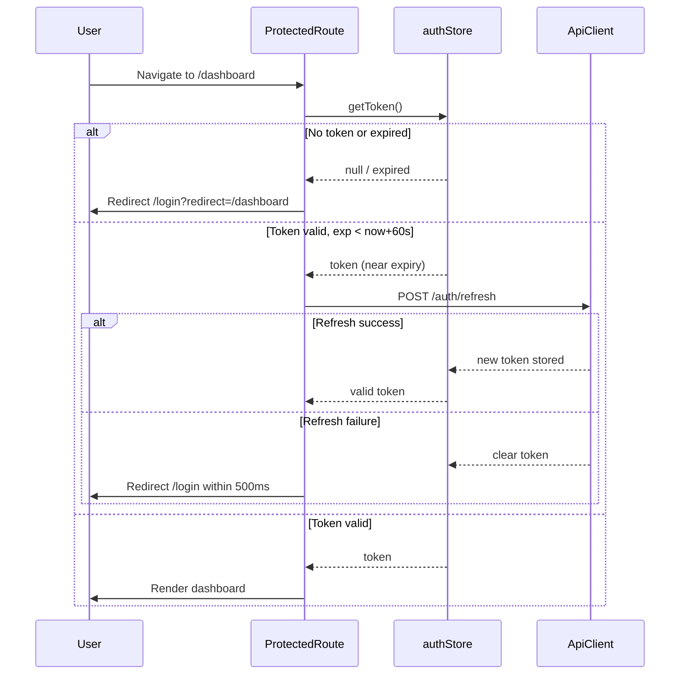

# Design Document: swarm-enterprise-frontend-outreach

## Overview

This design covers two major deliverable areas for SwarmEnterprise v2:

1. **Frontend SPA** — A production-grade React 18 + TypeScript + Vite single-page application replacing the existing static HTML dashboard in `frontend/public/`. It introduces a full authentication UI, main dashboard with real-time WebSocket feeds, project/company/deployment/tenant management, a Kanban ticket board, a visual workflow builder, analytics with CSV export, a CRM-style lead manager, and a dedicated Outreach Hub for campaign/sequence/inbox/reporting workflows.

2. **Cold Outreach & Marketing Automation Stack** — Four new Python agents (`Enrichment_Agent`, `Sequencer_Agent`, `Reply_Handler_Agent`, `CRM_Sync_Agent`) and one reporting agent (`Reporting_Agent`), each driven by Celery Beat, backed by new SQLAlchemy models, and surfaced through FastAPI endpoints. All agents use FOSS/self-hosted dependencies only (Ollama, imaplib, BeautifulSoup4, the existing `EmailTools`).

Both areas target the same quality bar as the existing backend (88/100, 92% test coverage), and are constrained to OSI-approved open-source licences only.

**Key design decisions:**

- React Query (`@tanstack/react-query`) is the single source of truth for all server state, eliminating ad-hoc `useState`+`useEffect` data-fetching.
- A typed `ApiClient` class wraps every REST, WebSocket, and SSE endpoint, so the UI layer never constructs URLs or handles raw `fetch` errors directly.
- All new Python agents are thin orchestrators over existing services (`EmailTools`, `LinearEngine`, `EventBus`) to minimise coupling.
- New SQLAlchemy models (`Sequence`, `SequenceEnrollment`, `SequenceStepLog`, `OutreachDailyMetrics`, `LeadTimeline`) are added via Alembic migrations, keeping the schema evolution auditable.

---

## Architecture

### High-Level System Diagram

```mermaid
graph TB
    subgraph Browser["Browser (SPA)"]
        Router["react-router-dom v6\nFile-based routing"]
        RQ["@tanstack/react-query\nServer-state cache"]
        ApiClient["ApiClient\nTyped REST + WS + SSE"]
        WS["WebSocket hook\nuseAgentFeed"]
        SSE["SSE hook\nuseBuildStream"]
        UI["Component Library\nsrc/components/ui/"]
    end

    subgraph Backend["FastAPI Backend (existing + new)"]
        Auth["/auth/*\nJWT endpoints"]
        LeadsAPI["/api/leads/*\n(expanded)"]
        OutreachAPI["/api/outreach/*\n(expanded)"]
        WorkflowsAPI["/api/workflows/*"]
        WSAPI["/api/ws\nWebSocket hub"]
        ReportsAPI["/api/outreach/reports/daily"]
        TimelineAPI["/api/leads/:id/timeline"]
    end

    subgraph Agents["Python Agents (new)"]
        Enrichment["Enrichment_Agent\nenrich_prospects (Celery)"]
        Sequencer["Sequencer_Agent\nprocess_due_sequence_steps"]
        ReplyHandler["Reply_Handler_Agent\ncheck_inbox_replies"]
        CRMSync["CRM_Sync_Agent\nevent_bus listener"]
        Reporting["Reporting_Agent\ngenerate_daily_outreach_report"]
    end

    subgraph Infra["Infrastructure (existing)"]
        DB["SQLite / PostgreSQL\nSQLAlchemy ORM"]
        Redis["Redis\nCelery broker + result backend"]
        Ollama["Ollama\nLocal LLM"]
        IMAP["IMAP Server\nimaplib"]
        SMTP["SMTP Server\nEmailTools"]
        EventBus["EventBus\nin-process pub/sub"]
    end

    Router --> RQ
    RQ --> ApiClient
    ApiClient --> Auth & LeadsAPI & OutreachAPI & WorkflowsAPI & WSAPI & ReportsAPI & TimelineAPI
    WS --> WSAPI
    SSE --> Backend

    Enrichment & Sequencer & ReplyHandler --> DB
    Enrichment --> Ollama
    ReplyHandler --> IMAP & Ollama
    Sequencer --> SMTP
    CRMSync --> EventBus & DB
    Reporting --> DB
    ReplyHandler --> EventBus
    Sequencer --> EventBus
    Enrichment --> EventBus
```



### Layer Responsibilities

| Layer | Technology | Responsibility |
|---|---|---|
| Routing | react-router-dom v6 | File-based routes under `src/pages/`; protected route wrapper |
| Server state | @tanstack/react-query | Caching, background refetch, optimistic mutations, error/loading states |
| API surface | `ApiClient` class | Typed wrappers for every endpoint; 429 back-off; auth header injection |
| UI primitives | Component Library | Accessible, token-driven primitives shared across all views |
| Agent tasks | Celery Beat | Periodic execution of outreach pipeline tasks |
| ORM | SQLAlchemy 2.x | New models for outreach pipeline; migrations via Alembic |
| LLM inference | Ollama | Entity extraction and email classification; deterministic fallback when unavailable |

---

## Components and Interfaces

### Frontend: File Structure

```
src/
├── components/
│   ├── ui/
│   │   ├── Button.tsx            # + __tests__/Button.test.tsx
│   │   ├── Input.tsx
│   │   ├── Select.tsx
│   │   ├── Textarea.tsx
│   │   ├── Modal.tsx
│   │   ├── Toast.tsx
│   │   ├── Badge.tsx
│   │   ├── Skeleton.tsx
│   │   ├── DataTable.tsx
│   │   ├── Tabs.tsx
│   │   ├── Card.tsx
│   │   ├── PageHeader.tsx
│   │   └── index.ts              # barrel export
│   ├── dashboard/
│   │   ├── AgentFeed.tsx
│   │   ├── KpiCard.tsx
│   │   ├── OutreachChart.tsx
│   │   └── BuildTerminal.tsx
│   ├── outreach/
│   │   ├── CampaignComposer.tsx
│   │   ├── SequenceBuilder.tsx
│   │   ├── InboxList.tsx
│   │   └── FunnelChart.tsx
│   ├── leads/
│   │   ├── LeadTable.tsx
│   │   ├── LeadDetail.tsx
│   │   ├── BulkActionsToolbar.tsx
│   │   └── PipelineBoard.tsx
│   └── workflows/
│       ├── WorkflowCanvas.tsx
│       └── NodeConfigPanel.tsx
├── pages/
│   ├── login.tsx
│   ├── register.tsx
│   ├── dashboard.tsx
│   ├── companies/
│   │   ├── index.tsx
│   │   └── [id].tsx
│   ├── deployments.tsx
│   ├── tenants.tsx
│   ├── tickets.tsx
│   ├── workflows/
│   │   ├── index.tsx
│   │   └── builder.tsx
│   ├── analytics.tsx
│   ├── leads.tsx
│   ├── outreach/
│   │   └── index.tsx
│   ├── profile.tsx
│   └── admin.tsx
├── services/
│   └── ApiClient.ts              # typed REST/WS/SSE client
├── hooks/
│   ├── useAuth.ts
│   ├── useAgentFeed.ts           # WebSocket hook
│   ├── useBuildStream.ts         # SSE hook
│   └── useNotifications.ts
├── store/
│   └── authStore.ts              # Zustand slice for JWT state
├── lib/
│   ├── mergeFields.ts            # merge-field interpolation (fast-check tested)
│   ├── dateRange.ts              # date-range computation helpers
│   ├── csvExport.ts              # CSV generation (fast-check tested)
│   └── leadDedup.ts              # deduplication logic (fast-check tested)
├── types/
│   └── api.ts                    # all API response/request types
├── App.tsx
├── main.tsx
├── service-worker.ts
└── vite-env.d.ts
```

### Frontend: ApiClient Interface

```typescript
// src/services/ApiClient.ts (simplified signatures)
export class ApiClient {
  // Auth
  register(payload: RegisterPayload): Promise<AuthResponse>
  login(payload: LoginPayload): Promise<AuthResponse>
  refresh(): Promise<AuthResponse>

  // Companies
  listCompanies(params: PaginationParams & FilterParams): Promise<PaginatedResponse<Company>>
  createCompany(payload: CompanyCreate): Promise<Company>
  getCompany(id: string): Promise<Company>

  // Deployments
  listDeployments(params: FilterParams & SortParams): Promise<Deployment[]>
  triggerDeploymentAction(id: string, action: 'start'|'stop'|'restart'): Promise<Deployment>

  // Tickets
  listTickets(): Promise<Ticket[]>
  updateTicket(id: string, patch: Partial<Ticket>): Promise<Ticket>

  // Workflows
  listWorkflows(): Promise<Workflow[]>
  createWorkflow(payload: WorkflowCreate): Promise<Workflow>
  triggerWorkflow(id: string): Promise<Workflow>

  // Leads
  listLeads(params: LeadQueryParams): Promise<PaginatedResponse<Lead>>
  getLead(id: string): Promise<LeadDetail>
  updateLead(id: string, patch: Partial<Lead>): Promise<Lead>
  enrichLead(id: string): Promise<void>
  bulkDeleteLeads(ids: string[]): Promise<void>
  enrollLeadsInSequence(leadIds: string[], sequenceId: string): Promise<void>

  // Outreach
  sendCampaign(payload: CampaignPayload): Promise<CampaignResponse>
  listSequences(): Promise<Sequence[]>
  createSequence(payload: SequenceCreate): Promise<Sequence>
  listInbox(): Promise<InboxReply[]>
  getDailyReport(start: string, end: string): Promise<DailyMetric[]>

  // Analytics
  getUsage(params: DateRangeParams): Promise<UsageData>
  getAdminStats(): Promise<AdminStats>

  // WebSocket (returns cleanup fn)
  subscribeAgentFeed(onMessage: (event: AgentEvent) => void): () => void
}
```

### Frontend: Auth Flow



### Backend: New Agent Interfaces

```python
# agents/outreach/enrichment_agent.py
class EnrichmentAgent:
    def run(self, niche_descriptor: str) -> list[ProspectRecord]: ...
    def _crawl_prospect(self, url: str) -> CrawlResult: ...
    def _extract_with_ollama(self, html: str, niche: str) -> ExtractedFields: ...
    def _extract_with_regex(self, html: str) -> ExtractedFields: ...
    def _compute_intent_score(self, signals: IntentSignals) -> int: ...

# agents/outreach/sequencer_agent.py
class SequencerAgent:
    def create_sequence(self, payload: SequenceCreate) -> Sequence: ...
    def enroll_prospect(self, lead_id: str, sequence_id: str) -> SequenceEnrollment: ...
    def process_due_steps(self) -> int: ...  # returns count of steps processed
    def render_template(self, template: str, prospect: Prospect) -> str: ...

# agents/outreach/reply_handler_agent.py
class ReplyHandlerAgent:
    def poll_inbox(self) -> int: ...  # returns count of emails processed
    def classify_reply(self, email: EmailMessage) -> ReplyClassification: ...
    def _classify_with_ollama(self, email: EmailMessage) -> ReplyClassification: ...
    def _classify_with_heuristics(self, email: EmailMessage) -> ReplyClassification: ...

# agents/outreach/crm_sync_agent.py
class CRMSyncAgent:
    def handle_prospect_discovered(self, payload: dict) -> None: ...
    def handle_sequence_enrolled(self, payload: dict) -> None: ...
    def handle_reply_received(self, payload: dict) -> None: ...
    def handle_sequence_completed(self, payload: dict) -> None: ...
    def get_lead_timeline(self, lead_id: str) -> list[TimelineEntry]: ...

# agents/outreach/reporting_agent.py
class ReportingAgent:
    def generate_daily_report(self, date: date) -> list[MetricRow]: ...
    def _compute_metrics(self, day: date) -> DailyMetrics: ...
```

### Backend: New API Endpoints

| Method | Path | Handler | Notes |
|---|---|---|---|
| GET | `/api/outreach/inbox` | `reply_handler_router` | List classified replies |
| GET | `/api/outreach/reports/daily` | `reporting_router` | `start_date`, `end_date` params; 400 on bad params |
| POST | `/api/outreach/sequence` | `sequencer_router` | Create sequence |
| GET | `/api/outreach/sequences` | `sequencer_router` | List sequences with stats |
| POST | `/api/outreach/sequence/enroll` | `sequencer_router` | Enroll leads |
| GET | `/api/leads/:id/timeline` | `crm_sync_router` | Lead state transitions |
| GET | `/api/outreach?period=week` | Extend existing | Weekly email count for Dashboard KPI |

These extend the existing `backend/api/outreach.py`, `backend/api/leads.py` and add new router modules for sequence, inbox, and reporting.

---

## Data Models

### New SQLAlchemy Models

```python
# backend/db/models_outreach.py  (new file; imported in alembic/env.py)

class Sequence(Base):
    __tablename__ = "sequences"
    id            = Column(String, primary_key=True, default=lambda: str(uuid4()))
    name          = Column(String(255), nullable=False)
    status        = Column(String, default="active")  # active | paused | archived
    steps_json    = Column(Text, nullable=False)        # JSON array of SequenceStep dicts
    created_at    = Column(DateTime, default=datetime.utcnow)
    updated_at    = Column(DateTime, default=datetime.utcnow, onupdate=datetime.utcnow)

class SequenceEnrollment(Base):
    __tablename__ = "sequence_enrollments"
    id            = Column(String, primary_key=True, default=lambda: str(uuid4()))
    lead_id       = Column(String, ForeignKey("leads.id"), index=True, nullable=False)
    sequence_id   = Column(String, ForeignKey("sequences.id"), index=True, nullable=False)
    current_step  = Column(Integer, default=0)
    status        = Column(String, default="active")
    # active | paused | replied | replied_interested | replied_uninterested | failed | completed
    enrolled_at   = Column(DateTime, default=datetime.utcnow)
    updated_at    = Column(DateTime, default=datetime.utcnow, onupdate=datetime.utcnow)
    __table_args__ = (UniqueConstraint("lead_id", "sequence_id",
                      name="uq_enrollment_lead_sequence"),)

class SequenceStepLog(Base):
    __tablename__ = "sequence_step_logs"
    id            = Column(String, primary_key=True, default=lambda: str(uuid4()))
    enrollment_id = Column(String, ForeignKey("sequence_enrollments.id"), index=True)
    step_index    = Column(Integer, nullable=False)
    outcome       = Column(String, nullable=False)   # sent | failed
    opens_tracked = Column(Boolean, default=False)
    opened_at     = Column(DateTime, nullable=True)
    sent_at       = Column(DateTime, nullable=True)
    error_message = Column(Text, nullable=True)

class OutreachDailyMetrics(Base):
    __tablename__ = "outreach_daily_metrics"
    id            = Column(String, primary_key=True, default=lambda: str(uuid4()))
    date          = Column(Date, nullable=False)
    metric_name   = Column(String, nullable=False)
    metric_value  = Column(Float, nullable=True)
    __table_args__ = (UniqueConstraint("date", "metric_name",
                      name="uq_daily_metric"),)

class LeadTimeline(Base):
    __tablename__ = "lead_timeline"
    id            = Column(String, primary_key=True, default=lambda: str(uuid4()))
    lead_id       = Column(String, ForeignKey("leads.id"), index=True, nullable=False)
    from_status   = Column(String, nullable=True)
    to_status     = Column(String, nullable=False)
    triggered_by  = Column(String, nullable=False)  # event type
    occurred_at   = Column(DateTime, default=datetime.utcnow)
```

### Existing Models — Required Field Additions

The existing `Lead` model needs two new columns:

```python
# Additions to Lead in backend/db/models.py (via Alembic migration)
website       = Column(String, nullable=True)
linkedin_url  = Column(String, nullable=True)
intent_score  = Column(Integer, default=0)
needs_review  = Column(Boolean, default=False)
email_invalid = Column(Boolean, default=False)
```

### TypeScript API Types

```typescript
// src/types/api.ts (key interfaces)
export interface Lead {
  id: string; email: string | null; name: string | null;
  company: string | null; website: string | null;
  linkedin_url: string | null; intent_score: number;
  status: 'NEW'|'CONTACTED'|'QUALIFIED'|'COLD'|'pipeline';
  needs_review: boolean; created_at: string;
}

export interface Sequence {
  id: string; name: string;
  steps: SequenceStep[]; status: 'active'|'paused'|'archived';
}

export interface SequenceStep {
  delay_days: number; subject_template: string; body_template: string;
}

export interface InboxReply {
  id: string; lead_id: string; sender: string;
  subject: string; body_preview: string;
  classification: 'interested'|'not_interested'|'auto_reply'|'bounce';
  received_at: string;
}

export interface DailyMetric {
  date: string; metric_name: string; metric_value: number | null;
}

export interface AgentEvent {
  timestamp: string; agent_name: string; message: string;
}

export interface TimelineEntry {
  from_status: string | null; to_status: string;
  triggered_by: string; occurred_at: string;
}
```

---

## Correctness Properties

*A property is a characteristic or behavior that should hold true across all valid executions of a system — essentially, a formal statement about what the system should do. Properties serve as the bridge between human-readable specifications and machine-verifiable correctness guarantees.*

### Property 1: Auth redirect preserves original path

*For any* protected route pathname and optional search string, when the user is unauthenticated and navigates to that route, the SPA SHALL redirect to `/login` with a `?redirect=` query parameter whose value exactly encodes the original pathname and search.

**Validates: Requirements 1.7**

---

### Property 2: Token refresh triggers within the 60-second window

*For any* JWT token whose `exp` claim is between 1 second and 59 seconds from the current time, the Auth module SHALL initiate `POST /auth/refresh` exactly once; for any token with `exp` 60 seconds or more away, no refresh SHALL be triggered.

**Validates: Requirements 1.8**

---

### Property 3: WebSocket event feed is capped and reverse-sorted

*For any* sequence of agent events received over WebSocket (length 1–500), the rendered feed SHALL contain at most 50 items and those items SHALL be ordered from newest to oldest by timestamp.

**Validates: Requirements 3.3**

---

### Property 4: WebSocket reconnect delay follows exponential back-off

*For any* reconnection attempt number n in [0, 9], the delay before that attempt SHALL equal `min(1 * 2^n, 30)` seconds (±10% jitter tolerance).

**Validates: Requirements 3.4**

---

### Property 5: Service degradation Toast fires on status change from "ok"

*For any* service name and any previous status of `"ok"`, when a new health-check response reports a non-`"ok"` status for that service, exactly one Toast notification containing `"<ServiceName> degraded"` SHALL be displayed. If the previous status was already non-`"ok"`, no additional Toast SHALL fire.

**Validates: Requirements 3.2**

---

### Property 6: Optimistic deployment action reverts on error

*For any* deployment record and any action in `{start, stop, restart}`, when the action is triggered the badge SHALL immediately show the optimistic status; if the API returns an error, the badge SHALL revert to its pre-action value and an error Toast SHALL be displayed.

**Validates: Requirements 4.8**

---

### Property 7: Workflow graph serialisation round-trip

*For any* valid reactflow node-and-edge graph containing 1–50 nodes, serialising to `steps_json` and then deserialising back SHALL produce a graph structurally equivalent to the original (same node IDs, edge connections, and parameter values).

**Validates: Requirements 5.5**

---

### Property 8: CSV export rows match date-filtered data exactly

*For any* analytics dataset and any date range [start, end] within that dataset, the rows in the exported CSV SHALL be in bijection with the rows returned by `filterByDateRange(data, start, end)` — no extra rows, no missing rows.

**Validates: Requirements 6.5**

---

### Property 9: Chart datasets are correctly computed from API responses

*For any* mock API response shapes from `GET /api/usage`, `GET /api/leads`, and `GET /api/outreach`, the computed chart datasets SHALL have one data point per calendar day in the selected range, with values that are the sum of the corresponding field for that day across all source records.

**Validates: Requirements 6.7, 6.1, 6.2**

---

### Property 10: Campaign validation blocks invalid input combinations

*For any* combination of field values for subject, recipients, message body, and scheduled datetime, `validateCampaignForm(fields)` SHALL return `valid = true` if and only if: subject length is in [1, 998], recipients is a non-empty array of ≤500 valid email addresses, body is non-empty, and scheduled datetime is strictly in the future.

**Validates: Requirements 8.2**

---

### Property 11: Inbox reply sort — interested replies always at top

*For any* list of inbox replies with mixed classifications, after sorting, ALL replies with classification `"interested"` SHALL appear before any reply with a different classification, and within each group replies SHALL be ordered by `received_at` descending.

**Validates: Requirements 8.8**

---

### Property 12: Sequence step validation rejects out-of-bounds values

*For any* sequence step object, `validateStep(step)` SHALL return `valid = false` if and only if `delay_days` is not an integer in [0, 365], `subject_template` is empty or exceeds 998 characters, or `body_template` is empty or exceeds 100,000 characters.

**Validates: Requirements 8.6**

---

### Property 13: Enrichment_Agent input validation

*For any* input string, the `EnrichmentAgent.run()` method SHALL accept it if and only if it contains at least 1 and at most 500 non-whitespace characters; all other inputs SHALL raise a descriptive `ValueError` before any I/O is initiated.

**Validates: Requirements 9.1**

---

### Property 14: Prospect deduplication by email

*For any* batch of discovered prospects where some share the same non-null email address, after all are persisted the `leads` table SHALL contain exactly one row per unique non-null email. Prospects with `email = null` SHALL each produce a new row regardless of other field values.

**Validates: Requirements 9.5, 9.6**

---

### Property 15: Intent score is additive and capped at 100

*For any* combination of observable signals (job_posting_match, email_resolved, homepage_200, name_in_results), the computed intent_score SHALL equal `min(sum_of_applicable_bonuses, 100)` where the bonuses are 30, 20, 20, and 30 respectively.

**Validates: Requirements 9.7**

---

### Property 16: Merge-field substitution leaves no raw tokens

*For any* email template string containing any subset of `{{first_name}}`, `{{last_name}}`, `{{company}}`, `{{website}}` tokens, and any prospect record with arbitrary (including null) field values, `renderTemplate(template, prospect)` SHALL return a string containing none of the pattern `/\{\{[a-z_]+\}\}/`.

**Validates: Requirements 10.3**

---

### Property 17: Sequence step scheduled time arithmetic

*For any* enrollment record with `enrolled_at` timestamp T and a sequence with steps having `delay_days` d₀, d₁, …, dₙ, the scheduled send time of step k SHALL equal `T + timedelta(days=sum(d₀..dₖ))`.

**Validates: Requirements 10.4**

---

### Property 18: Reply classification output is always a valid label

*For any* email message (any sender, subject, body), `ReplyHandlerAgent.classify_reply()` SHALL return exactly one of `{"interested", "not_interested", "auto_reply", "bounce"}` and SHALL never raise an unhandled exception.

**Validates: Requirements 11.2**

---

### Property 19: IMAP UID stored only after all downstream actions succeed

*For any* email message, if any of the downstream actions (enrollment update, ticket creation, event bus publish) raises an exception, the message UID SHALL NOT be present in `processed_events`; only when all downstream actions complete successfully SHALL the UID be stored.

**Validates: Requirements 11.7**

---

### Property 20: CRM state machine transitions are deterministic

*For any* lead record with current status S and any inbound event E from the set `{prospect_discovered, sequence_enrolled, reply_received(interested), sequence_completed(no_reply)}`, the resulting status SHALL exactly match the transition table: `NEW→CONTACTED` on `sequence_enrolled`, `CONTACTED→QUALIFIED` on `reply_received(interested)`, `CONTACTED→COLD` on `sequence_completed(no_reply)`.

**Validates: Requirements 12.2, 12.3, 12.4, 12.5**

---

### Property 21: Reporting metrics arithmetic correctness

*For any* set of `SequenceStepLog` and `SequenceEnrollment` rows for a given date, the computed `open_rate` SHALL equal `opens/sent` when `opens_tracked = true` records exist (and `null` otherwise), and `reply_rate` SHALL equal `replied_enrollments/sent_emails` (and `null` when `sent = 0`).

**Validates: Requirements 13.1**

---

### Property 22: Reporting task idempotency (upsert)

*For any* date d and any set of source rows, running `generate_daily_report(d)` twice in succession SHALL produce the same set of `outreach_daily_metrics` rows as running it once — no duplicate rows, no row count increase on the second run.

**Validates: Requirements 13.6**

---

### Property 23: API client 429 back-off stays within bounds

*For any* sequence of HTTP 429 responses on a single request (up to 5 consecutive retries), the delay before retry attempt n SHALL satisfy `1s * 2^n + jitter ≤ 30s`, and no more than 5 retry attempts SHALL be made before the error is surfaced to the UI.

**Validates: Requirements 15.7**

---

## Error Handling

### Frontend Error Handling Strategy

**Global layer — React Query + Toast**

React Query's `onError` callback and a global `QueryCache` `onError` handler surface all failed API calls as dismissable Toast notifications (8-second auto-dismiss, also manually dismissable via ×). The Toast hook reads the `error.message` or `error.response.data.detail` field to construct the message text.

**Per-request error states**

Every page-level query renders one of three states:
- `isLoading` → Skeleton components matching the expected layout dimensions (CLS ≤ 0.1)
- `isError` → Inline error card with "Retry" button that calls `refetch()`
- `isSuccess` with empty array → Accessible empty-state illustration with descriptive alt text

**Optimistic mutations**

All drag-and-drop operations (Kanban ticket moves, Pipeline lead moves, Deployment actions) use `useMutation` with `onMutate` (optimistic update), `onError` (rollback + Toast), and `onSettled` (reconcile from server response). The rollback context is stored in React Query's mutation context object.

**Auth errors**

HTTP 401 responses trigger an interceptor in `ApiClient` that clears `localStorage.auth_token` and redirects to `/login?redirect=<current path>` within 500ms. HTTP 403 responses display an "Access Denied" Toast without redirecting.

**WebSocket error handling**

The `useAgentFeed` hook implements an exponential back-off reconnect loop (1s → 2s → 4s … capped at 30s, max 10 attempts). A `status` state atom drives a visible "Reconnecting…" / "Connection lost" banner in the Dashboard.

**SSE (Build Terminal) error handling**

If the SSE stream closes before an `event: done` message is received, the terminal widget displays "Stream ended unexpectedly" and stops rendering. The connection is not retried automatically.

### Backend Error Handling Strategy

**Agent-level exception isolation**

Each Celery task wraps its top-level execution in a `try/except` block. Unhandled exceptions are logged with `logger.exception()` and the task exits with a failure status rather than raising to the worker. This prevents worker process crashes and allows Celery's DLQ mechanism to receive the event.

**Ollama unavailability**

Both `EnrichmentAgent` and `ReplyHandlerAgent` set a 10-second connection timeout on all Ollama calls. A `TimeoutError` or `ConnectionRefusedError` is caught, a `WARNING` is logged, and the code falls back to regex/heuristic logic. The fallback path is on a separate code branch, making it independently testable.

**IMAP connection failures**

`check_inbox_replies` catches `imaplib.IMAP4.error`, `socket.timeout`, and `OSError` at the top of the task. On any IMAP connection failure, the agent logs `ERROR` and returns without re-raising, ensuring the Celery worker remains healthy.

**Database transaction failures**

`CRM_Sync_Agent.handle_reply_received` wraps the lead status update and ticket creation in a single SQLAlchemy `Session.begin()` context. On any exception, the context manager rolls back automatically. The event is discarded (not retried) to avoid partial side effects.

**Email send failures**

`SequencerAgent` catches the `"ERROR:"` return value from `EmailTools.send_email()` (the existing contract) and marks the step as `failed` in `SequenceStepLog`, then sets enrollment status to `paused`. It does not raise, ensuring other enrollments continue processing.

**HTTP 429 retry (ApiClient)**

`ApiClient` wraps all `fetch` calls in a retry loop: on HTTP 429, it waits `min(1 * 2^retryCount, 30) + random(0, 1000)ms` jitter before retrying. After 5 retries the original `Response` object is thrown to the calling React Query hook, which surfaces it as a Toast.

---

## Testing Strategy

### Frontend Testing

**Framework:** Vitest + React Testing Library + `@testing-library/user-event` + `fast-check`

**Coverage enforcement:** `vitest.config.ts` configures `@vitest/coverage-v8` with `thresholds: { statements: 90, branches: 90, functions: 90, lines: 90 }`. Vitest exits non-zero if any threshold is not met.

**Test file co-location:** Every `.tsx` component file under `src/components/` has a corresponding `__tests__/<ComponentName>.test.tsx`. The CI `frontend-test` job fails if a new `.tsx` under `src/components/` lacks its test file.

**Unit tests (example-based)**

Each Component Library primitive has unit tests covering:
- Default render (snapshot/assertion)
- All prop variants (e.g., Button `variant`, `size`, `disabled`)
- Accessibility attributes (role, aria-label, aria-describedby)
- Event handler invocation (onClick, onChange, onSubmit)
- Error/empty states where applicable

Each page-level component has unit tests for:
- Loading state (Skeleton visible, interactive elements absent)
- Success state (data rendered correctly)
- Error state (error card with "Retry" visible)
- Empty state (empty-state illustration with alt text and CTA)

**Integration tests (user-event)**

Kanban drag operations and Workflow Builder node operations use `@testing-library/user-event` to simulate drag-and-drop via pointer events. These tests assert:
- Optimistic update appears immediately
- API mock called with correct payload
- On mock error: card/node reverts, Toast appears

**Property-based tests (fast-check)**

Minimum 100 trials each. Tag format: `// Feature: swarm-enterprise-frontend-outreach, Property N: <text>`

| Test file | Property | fast-check generators |
|---|---|---|
| `src/lib/__tests__/mergeFields.test.ts` | Property 16: no raw tokens after substitution | `fc.record()` with nullable string fields, arbitrary templates |
| `src/lib/__tests__/dateRange.test.ts` | Property 9: one data point per calendar day in range | `fc.date()` pairs for start/end, `fc.array()` of usage records |
| `src/lib/__tests__/csvExport.test.ts` | Property 8: CSV rows ↔ filtered dataset bijection | `fc.array()` of dated records, `fc.date()` range pairs |
| `src/lib/__tests__/leadDedup.test.ts` | Property 14 (frontend dedup display logic) | `fc.array()` of leads with nullable email |
| `src/hooks/__tests__/useAuth.test.ts` | Property 1: redirect preserves path | `fc.webPath()` generator |
| `src/hooks/__tests__/useAuth.test.ts` | Property 2: refresh triggered in 60s window | `fc.integer()` for seconds-to-expiry |
| `src/hooks/__tests__/useAgentFeed.test.ts` | Property 3: feed capped at 50, reverse-sorted | `fc.array(fc.record(), {minLength: 1, maxLength: 200})` |
| `src/services/__tests__/ApiClient.test.ts` | Property 23: 429 back-off within bounds | `fc.integer({min:1, max:5})` for retry count |
| `src/components/outreach/__tests__/InboxList.test.ts` | Property 11: interested replies always first | `fc.array()` of reply records with random classifications |
| `src/components/outreach/__tests__/CampaignComposer.test.ts` | Property 10: validation accepts/rejects correctly | `fc.record()` with all field generators |

**Snapshot tests**

Chart rendering functions in `OutreachChart`, `FunnelChart`, and `Analytics` page are snapshot-tested with mock API responses. Each snapshot is committed and re-verified on every CI run.

**Lighthouse CI**

The `lighthouse-ci` job in `.github/workflows/ci.yml` runs against the built Dashboard route in a simulated Moto G4 / Fast 3G environment and asserts Performance score ≥ 85.

**Bundle size check**

A CI step after `vite build` measures the gzip size of all synchronously loaded entry and shared vendor chunks for the Dashboard route and fails if the total exceeds 400 KB.

### Backend Testing

**Framework:** Pytest + pytest-cov + Hypothesis

**Coverage enforcement:** `pyproject.toml` has `[tool.coverage.report] fail_under = 90`. The CI `backend-test` job runs `pytest --cov --cov-fail-under=90`.

**Test file co-location:** For every new `.py` file under `agents/` or `backend/services/`, there must be a corresponding `tests/agents/test_<filename>.py` or `tests/services/test_<filename>.py`. The CI job fails if this contract is violated (enforced via a pre-commit hook that checks the mapping).

**Unit tests (mocked dependencies)**

Every agent method is tested with mocked: Ollama client, `requests.get`, `imaplib.IMAP4_SSL`, `EmailTools.send_email`, and the SQLAlchemy session. Tests cover:
- Happy path (all dependencies succeed)
- Ollama unavailable (fallback path exercised)
- IMAP connection failure (graceful exit)
- Email send failure (step marked failed, enrollment paused)
- Duplicate enrollment rejection
- DB transaction rollback on error (CRM_Sync_Agent)

**Property-based tests (Hypothesis)**

Minimum 100 examples each. Tag format: `# Feature: swarm-enterprise-frontend-outreach, Property N: <text>`

| Test file | Property | Hypothesis strategies |
|---|---|---|
| `tests/agents/test_enrichment_agent.py` | Property 13: input validation | `st.text()`, `st.just("")`, `st.just(" " * 501)` |
| `tests/agents/test_enrichment_agent.py` | Property 14: prospect deduplication | `st.lists(st.builds(Prospect, ...))` with shared emails |
| `tests/agents/test_enrichment_agent.py` | Property 15: intent score capped at 100 | `st.frozensets(st.sampled_from(['job_post','email','homepage','name']))` |
| `tests/agents/test_sequencer_agent.py` | Property 16: merge-field substitution | `st.text()` templates + `st.builds(Prospect)` with nullable fields |
| `tests/agents/test_sequencer_agent.py` | Property 17: step scheduling arithmetic | `st.datetimes()` + `st.lists(st.integers(0, 365))` |
| `tests/agents/test_reply_handler_agent.py` | Property 18: classification always valid label | `st.builds(EmailMessage, ...)` |
| `tests/agents/test_reply_handler_agent.py` | Property 19: UID stored only on full success | `st.booleans()` for each downstream action success/fail |
| `tests/agents/test_crm_sync_agent.py` | Property 20: state machine transitions | `st.sampled_from(LeadStatus)` + `st.sampled_from(EventType)` |
| `tests/agents/test_reporting_agent.py` | Property 21: metrics arithmetic | `st.integers(min_value=0)` for sent/opens/replies/bounces |
| `tests/agents/test_reporting_agent.py` | Property 22: idempotency (upsert) | `st.dates()` + random metric data |

**Email address normalisation (explicit requirement 14.8)**

`tests/services/test_email_normaliser.py` uses Hypothesis `st.emails()` to verify that normalisation (lowercasing, stripping whitespace) is idempotent: `normalise(normalise(x)) == normalise(x)`.

**Integration / smoke tests**

`tests/agents/test_outreach_integration.py` uses the existing SQLite test DB (in-memory via `SessionLocal` override in conftest) to run a full happy-path flow: enrich → enroll → process step → classify reply → CRM sync → report — asserting final DB state without mocking the ORM layer.
