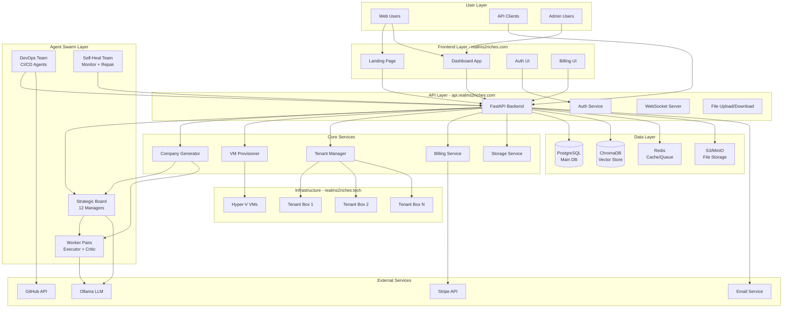
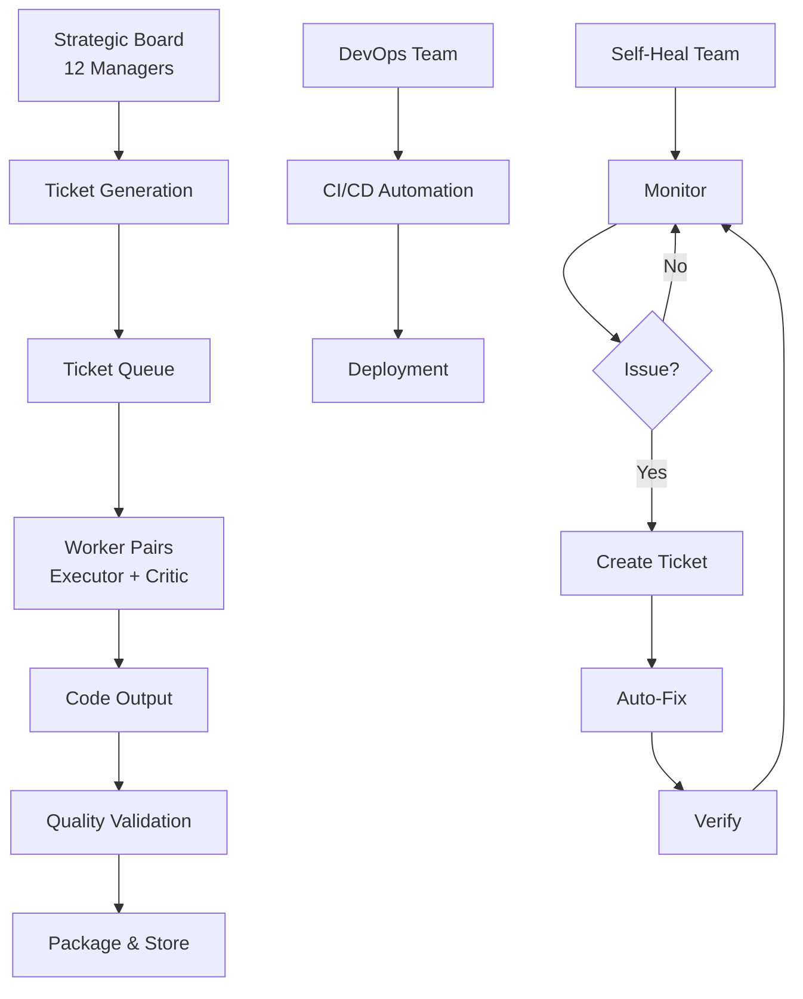
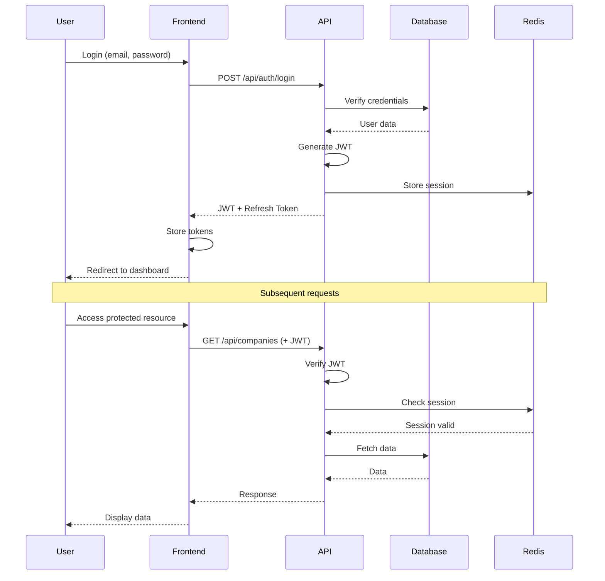
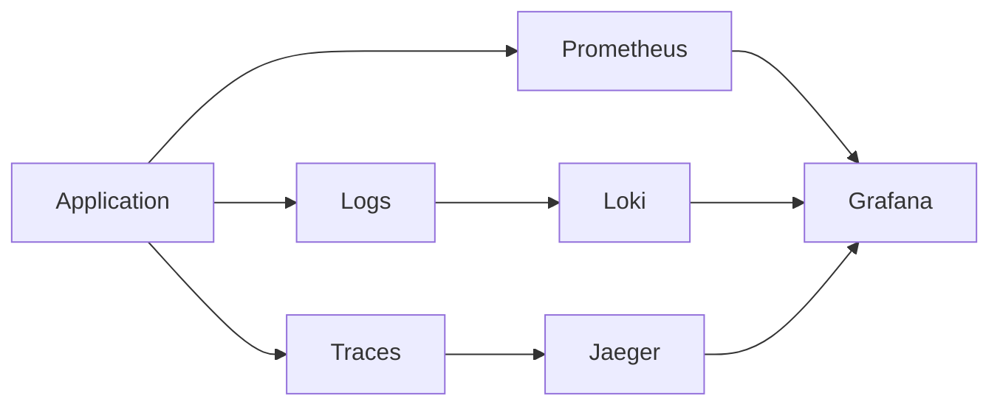

# SwarmEnterprise v2 - System Architecture

## Overview

SwarmEnterprise is a fully autonomous digital factory that generates, deploys, and maintains "Company-in-a-Box" applications using AI agent swarms. The system operates across multiple domains with complete automation and self-healing capabilities.

---

## System Architecture Diagram



---

## Domain Architecture

### Domain Topology

| Domain | Purpose | Technology | SSL |
|--------|---------|------------|-----|
| `realms2riches.com` | Main landing page & dashboard | Static HTML + React | ✅ |
| `www.realms2riches.com` | Redirect to main | CNAME | ✅ |
| `api.realms2riches.com` | Backend API | FastAPI | ✅ |
| `corp.realms2riches.com` | Corporate info | Static HTML | ✅ |
| `realms2riches.tech` | Tenant showcase | Static HTML | ✅ |
| `*.realms2riches.tech` | Individual tenant boxes | Docker containers | ✅ |

### Reverse Proxy Configuration (Caddy)

```
Internet → Caddy (ports 80/443)
    ├── realms2riches.com → Frontend static files
    ├── api.realms2riches.com → Backend container :8000
    ├── corp.realms2riches.com → Frontend static files
    └── *.realms2riches.tech → Tenant containers (dynamic routing)
```

---

## Component Architecture

### 1. Frontend Layer

#### Landing Page (`realms2riches.com`)
```
frontend/public/
├── index.html          # Hero, features, pricing
├── features.html       # Detailed feature showcase
├── pricing.html        # Pricing tiers
├── about.html          # Company info
├── config.js           # API endpoint configuration
└── assets/
    ├── css/
    │   └── styles.css  # Tailwind + custom styles
    ├── js/
    │   └── main.js     # Interactive elements
    └── images/
        └── *.svg       # Icons and graphics
```

**Key Features:**
- Responsive design (mobile-first)
- Fast loading (<2s)
- SEO optimized
- Analytics integration
- Newsletter signup
- Live chat widget

#### Dashboard Application
```
frontend/dashboard/
├── src/
│   ├── components/
│   │   ├── Auth/
│   │   │   ├── Login.tsx
│   │   │   ├── Register.tsx
│   │   │   └── PasswordReset.tsx
│   │   ├── Companies/
│   │   │   ├── CompanyBuilder.tsx
│   │   │   ├── CompanyList.tsx
│   │   │   ├── CompanyDetail.tsx
│   │   │   └── TemplateSelector.tsx
│   │   ├── Deployments/
│   │   │   ├── DeploymentManager.tsx
│   │   │   ├── VMConfigurator.tsx
│   │   │   └── StatusMonitor.tsx
│   │   ├── Billing/
│   │   │   ├── SubscriptionManager.tsx
│   │   │   ├── InvoiceList.tsx
│   │   │   └── PaymentMethods.tsx
│   │   └── Admin/
│   │       ├── UserManagement.tsx
│   │       ├── SystemHealth.tsx
│   │       └── Analytics.tsx
│   ├── pages/
│   ├── services/
│   │   ├── api.ts
│   │   ├── auth.ts
│   │   └── websocket.ts
│   ├── store/
│   │   └── index.ts
│   └── utils/
├── public/
└── package.json
```

**Technology Stack:**
- React 18 + TypeScript
- Vite for build
- TailwindCSS for styling
- React Query for data fetching
- Zustand for state management
- React Router for navigation
- WebSocket for real-time updates

### 2. Backend API Layer

#### Core API Structure
```
backend/
├── main.py                 # FastAPI app initialization
├── api/
│   ├── routes.py          # Core build endpoints
│   ├── tenants.py         # Tenant management
│   ├── companies.py       # NEW: Company generation
│   ├── deployments.py     # NEW: Deployment management
│   ├── auth.py            # NEW: Authentication
│   ├── users.py           # NEW: User management
│   ├── admin.py           # Admin endpoints
│   ├── billing.py         # Billing & subscriptions
│   ├── payments.py        # Payment processing
│   ├── webhooks.py        # Webhook handlers
│   ├── leads.py           # Lead management
│   ├── outreach.py        # Outreach campaigns
│   ├── usage.py           # Usage tracking
│   ├── voice.py           # Voice/TTS features
│   └── ops.py             # Operations & monitoring
├── core/
│   ├── factory.py         # Swarm factory orchestration
│   ├── tenants.py         # Tenant service
│   ├── auth.py            # NEW: Auth service
│   └── config.py          # NEW: Configuration management
├── services/
│   ├── company_generator.py  # NEW: Company generation
│   ├── template_engine.py    # NEW: Template processing
│   ├── code_packager.py      # NEW: Code packaging
│   └── deployment_service.py # NEW: Deployment automation
├── orchestration/
│   ├── box_deployer.py    # Docker container deployment
│   └── vm_provisioner.py  # NEW: VM provisioning
├── storage/
│   ├── s3_client.py       # NEW: S3/MinIO client
│   └── file_manager.py    # NEW: File operations
├── auth/
│   ├── jwt_handler.py     # NEW: JWT management
│   ├── user_service.py    # NEW: User CRUD
│   └── permissions.py     # NEW: RBAC
├── billing/
│   ├── subscription_service.py  # NEW: Subscriptions
│   ├── usage_tracker.py         # NEW: Usage tracking
│   └── invoice_generator.py     # NEW: Invoice generation
└── db/
    ├── models.py          # NEW: SQLAlchemy models
    ├── tenant_models.py   # Tenant models
    └── linear_engine.py   # Ticket database
```

#### API Endpoints (Complete List)

**Authentication & Users**
```
POST   /api/auth/register
POST   /api/auth/login
POST   /api/auth/logout
POST   /api/auth/refresh
POST   /api/auth/reset-password
GET    /api/users/me
PUT    /api/users/me
DELETE /api/users/me
```

**Company Generation**
```
POST   /api/companies/generate
GET    /api/companies
GET    /api/companies/{id}
GET    /api/companies/{id}/status
GET    /api/companies/{id}/download
DELETE /api/companies/{id}
POST   /api/companies/{id}/regenerate
```

**Deployments**
```
POST   /api/deployments/create
GET    /api/deployments
GET    /api/deployments/{id}
GET    /api/deployments/{id}/status
POST   /api/deployments/{id}/start
POST   /api/deployments/{id}/stop
POST   /api/deployments/{id}/restart
DELETE /api/deployments/{id}
GET    /api/deployments/{id}/logs
```

**Tenants**
```
POST   /api/tenants/register
GET    /api/tenants
GET    /api/tenants/{id}
POST   /api/tenants/{id}/provision
GET    /api/tenants/{id}/status
DELETE /api/tenants/{id}
```

**Billing & Subscriptions**
```
GET    /api/billing/plans
POST   /api/billing/subscribe
GET    /api/billing/subscription
PUT    /api/billing/subscription
DELETE /api/billing/subscription
GET    /api/billing/invoices
GET    /api/billing/usage
POST   /api/payments/create-checkout-session
POST   /api/webhooks/stripe
```

**Operations & Monitoring**
```
GET    /api/ops/status
POST   /api/ops/heal
GET    /api/ops/metrics
GET    /api/ops/logs
GET    /api/ops/agents
```

**Admin**
```
GET    /api/admin/users
GET    /api/admin/companies
GET    /api/admin/deployments
GET    /api/admin/analytics
POST   /api/admin/users/{id}/suspend
```

### 3. Agent Swarm Layer

#### Agent Hierarchy



#### Agent Roles & Responsibilities

**Strategic Board (12 Managers)**
1. **CTO** - Technical strategy and architecture decisions
2. **CPO** - Product features and user experience
3. **Chief Architect** - System design and patterns
4. **Security Director** - Security requirements and audits
5. **DevOps Director** - Infrastructure and deployment
6. **QA Director** - Testing strategy and quality gates
7. **UI/UX Director** - Interface design and usability
8. **Marketing Director** - Marketing features and analytics
9. **Outreach Director** - Communication and notifications
10. **Replicator Lead** - Self-replication and scaling
11. **Documentation Manager** - Documentation generation
12. **Compliance Manager** - Legal and compliance requirements

**DevOps Team**
- **CI/CD Manager** - Pipeline orchestration
- **Deployment Agent** - Automated deployments
- **Rollback Agent** - Failure recovery
- **Dependency Updater** - Package management
- **Security Scanner** - Vulnerability detection
- **Performance Optimizer** - Performance tuning

**Worker Pairs**
- **Lead Developer** - Code implementation
- **Security Overseer** - Code review and audit

**Self-Heal Team**
- **Monitor Agent** - System health monitoring
- **Repair Agent** - Automated fixes
- **Escalation Agent** - Human notification when needed

#### Agent Communication Protocol

```python
# Ticket Format
{
    "ticket_id": "TKT-ABC123",
    "department": "Engineering",
    "priority": "high",
    "title": "Implement user authentication",
    "instruction": "Create JWT-based auth system...",
    "assigned_to": "worker-pair-1",
    "status": "in_progress",
    "created_at": "2026-05-22T17:00:00Z",
    "updated_at": "2026-05-22T17:15:00Z",
    "metadata": {
        "estimated_time": "2h",
        "dependencies": ["TKT-ABC122"],
        "files_affected": ["backend/auth/jwt_handler.py"]
    }
}
```

### 4. Data Layer

#### Database Schema

**PostgreSQL (Main Database)**
```sql
-- Users
CREATE TABLE users (
    id UUID PRIMARY KEY,
    email VARCHAR(255) UNIQUE NOT NULL,
    password_hash VARCHAR(255) NOT NULL,
    full_name VARCHAR(255),
    role VARCHAR(50) DEFAULT 'user',
    subscription_tier VARCHAR(50) DEFAULT 'free',
    created_at TIMESTAMP DEFAULT NOW(),
    updated_at TIMESTAMP DEFAULT NOW()
);

-- Companies (Generated)
CREATE TABLE companies (
    id UUID PRIMARY KEY,
    user_id UUID REFERENCES users(id),
    name VARCHAR(255) NOT NULL,
    slug VARCHAR(255) UNIQUE NOT NULL,
    description TEXT,
    tech_stack VARCHAR(100),
    status VARCHAR(50) DEFAULT 'pending',
    template_id VARCHAR(100),
    generation_started_at TIMESTAMP,
    generation_completed_at TIMESTAMP,
    download_count INTEGER DEFAULT 0,
    storage_path VARCHAR(500),
    metadata JSONB,
    created_at TIMESTAMP DEFAULT NOW()
);

-- Deployments
CREATE TABLE deployments (
    id UUID PRIMARY KEY,
    company_id UUID REFERENCES companies(id),
    user_id UUID REFERENCES users(id),
    vm_id VARCHAR(255),
    container_id VARCHAR(255),
    subdomain VARCHAR(255) UNIQUE,
    status VARCHAR(50) DEFAULT 'pending',
    url VARCHAR(500),
    resources JSONB,
    last_health_check TIMESTAMP,
    created_at TIMESTAMP DEFAULT NOW(),
    updated_at TIMESTAMP DEFAULT NOW()
);

-- Tenants (Company Boxes)
CREATE TABLE company_tenants (
    id VARCHAR(50) PRIMARY KEY,
    slug VARCHAR(100) UNIQUE NOT NULL,
    name VARCHAR(255) NOT NULL,
    subdomain VARCHAR(255),
    status VARCHAR(50) DEFAULT 'pending',
    vm_id VARCHAR(255),
    container_id VARCHAR(255),
    box_url VARCHAR(500),
    last_error TEXT,
    metadata_json TEXT,
    created_at TIMESTAMP DEFAULT NOW(),
    updated_at TIMESTAMP DEFAULT NOW()
);

-- Subscriptions
CREATE TABLE subscriptions (
    id UUID PRIMARY KEY,
    user_id UUID REFERENCES users(id),
    stripe_subscription_id VARCHAR(255),
    plan VARCHAR(50) NOT NULL,
    status VARCHAR(50) DEFAULT 'active',
    current_period_start TIMESTAMP,
    current_period_end TIMESTAMP,
    cancel_at_period_end BOOLEAN DEFAULT FALSE,
    created_at TIMESTAMP DEFAULT NOW(),
    updated_at TIMESTAMP DEFAULT NOW()
);

-- Usage Tracking
CREATE TABLE usage_records (
    id UUID PRIMARY KEY,
    user_id UUID REFERENCES users(id),
    deployment_id UUID REFERENCES deployments(id),
    metric_type VARCHAR(50),
    value DECIMAL(10,2),
    unit VARCHAR(20),
    recorded_at TIMESTAMP DEFAULT NOW()
);

-- Tickets
CREATE TABLE tickets (
    id VARCHAR(50) PRIMARY KEY,
    project_id VARCHAR(100),
    department VARCHAR(100),
    title VARCHAR(500),
    instruction TEXT,
    status VARCHAR(50) DEFAULT 'pending',
    assigned_to VARCHAR(100),
    priority VARCHAR(20) DEFAULT 'medium',
    created_at TIMESTAMP DEFAULT NOW(),
    updated_at TIMESTAMP DEFAULT NOW(),
    completed_at TIMESTAMP
);
```

**ChromaDB (Vector Store)**
- Agent memory and context
- Code embeddings for similarity search
- Documentation embeddings
- User query history

**Redis (Cache & Queue)**
- Session storage
- API rate limiting
- Background job queue (Celery)
- Real-time data cache
- WebSocket pub/sub

**S3/MinIO (File Storage)**
```
bucket: swarm-companies/
├── {company_id}/
│   ├── source.zip
│   ├── README.md
│   ├── deploy.sh
│   └── metadata.json
```

### 5. Infrastructure Layer

#### Container Architecture

```yaml
# docker-compose.production.yml
services:
  backend:
    image: ghcr.io/realms2riches/swarmenterprise-backend:latest
    ports:
      - "8000:8000"
    environment:
      - DATABASE_URL=postgresql://...
      - REDIS_URL=redis://redis:6379
      - S3_ENDPOINT=http://minio:9000
      - OLLAMA_URL=http://192.168.1.50:11434
    networks:
      - swarmnet
    restart: always

  redis:
    image: redis:7-alpine
    networks:
      - swarmnet
    restart: always

  postgres:
    image: postgres:15-alpine
    environment:
      - POSTGRES_DB=swarm
      - POSTGRES_USER=swarm
      - POSTGRES_PASSWORD=${DB_PASSWORD}
    volumes:
      - postgres_data:/var/lib/postgresql/data
    networks:
      - swarmnet
    restart: always

  minio:
    image: minio/minio:latest
    command: server /data --console-address ":9001"
    environment:
      - MINIO_ROOT_USER=${MINIO_USER}
      - MINIO_ROOT_PASSWORD=${MINIO_PASSWORD}
    volumes:
      - minio_data:/data
    networks:
      - swarmnet
    restart: always

  caddy:
    image: caddy:2-alpine
    ports:
      - "80:80"
      - "443:443"
    volumes:
      - ./deploy/Caddyfile:/etc/caddy/Caddyfile
      - caddy_data:/data
      - caddy_config:/config
    networks:
      - swarmnet
    restart: always

  # Tenant boxes (dynamic)
  r2r-box-{slug}:
    image: ${TENANT_IMAGE}
    labels:
      - "swarm.tenant_id=${TENANT_ID}"
      - "swarm.subdomain=${SLUG}.realms2riches.tech"
    networks:
      - swarmnet
    restart: always

networks:
  swarmnet:
    driver: bridge

volumes:
  postgres_data:
  minio_data:
  caddy_data:
  caddy_config:
```

#### VM Provisioning (Hyper-V)

```powershell
# Automated VM creation
New-VM -Name "r2r-tenant-{slug}" `
       -MemoryStartupBytes 4GB `
       -Generation 2 `
       -NewVHDPath "C:\VMs\{slug}.vhdx" `
       -NewVHDSizeBytes 50GB

# Network configuration
Add-VMNetworkAdapter -VMName "r2r-tenant-{slug}" -SwitchName "External"

# Install OS (Ubuntu Server)
# Configure Docker
# Deploy company code
# Set up monitoring
```

---

## Security Architecture

### Authentication Flow



### Security Measures

1. **Authentication**
   - JWT with short expiration (15 min)
   - Refresh tokens (7 days)
   - Secure password hashing (bcrypt)
   - Rate limiting on auth endpoints

2. **Authorization**
   - Role-based access control (RBAC)
   - Resource-level permissions
   - API key authentication for programmatic access

3. **Data Protection**
   - HTTPS everywhere (TLS 1.3)
   - Database encryption at rest
   - Secrets management (environment variables)
   - Input validation and sanitization

4. **Infrastructure Security**
   - Container isolation
   - Network segmentation
   - Firewall rules
   - Regular security audits
   - Automated vulnerability scanning

5. **Monitoring & Logging**
   - Audit logs for all actions
   - Anomaly detection
   - Intrusion detection
   - Security incident response

---

## Scalability & Performance

### Horizontal Scaling

```
Load Balancer
    ├── Backend Instance 1
    ├── Backend Instance 2
    └── Backend Instance N

Database Cluster
    ├── Primary (Write)
    └── Replicas (Read)

Redis Cluster
    ├── Master
    └── Replicas

Storage (S3/MinIO)
    └── Distributed across nodes
```

### Caching Strategy

1. **API Response Cache** (Redis)
   - TTL: 5-60 minutes
   - Invalidation on updates

2. **Database Query Cache**
   - Frequently accessed data
   - User sessions

3. **CDN for Static Assets**
   - Frontend files
   - Generated company downloads

### Performance Optimization

1. **Database**
   - Indexed queries
   - Connection pooling
   - Query optimization
   - Partitioning for large tables

2. **API**
   - Async/await for I/O operations
   - Background tasks for long operations
   - Pagination for large datasets
   - Compression (gzip)

3. **Frontend**
   - Code splitting
   - Lazy loading
   - Image optimization
   - Service worker caching

---

## Monitoring & Observability

### Metrics Collection



### Key Metrics

**System Metrics**
- CPU usage
- Memory usage
- Disk I/O
- Network traffic

**Application Metrics**
- Request rate
- Response time (p50, p95, p99)
- Error rate
- Active users

**Business Metrics**
- Companies generated
- Deployments created
- Revenue (MRR/ARR)
- User growth

### Alerting Rules

```yaml
alerts:
  - name: HighErrorRate
    condition: error_rate > 5%
    duration: 5m
    action: notify_ops_team
    
  - name: SlowResponse
    condition: p95_response_time > 1s
    duration: 10m
    action: notify_ops_team
    
  - name: ServiceDown
    condition: health_check_failed
    duration: 1m
    action: trigger_self_heal
```

---

## Disaster Recovery

### Backup Strategy

1. **Database Backups**
   - Full backup: Daily
   - Incremental: Hourly
   - Retention: 30 days
   - Off-site storage

2. **File Storage Backups**
   - Versioning enabled
   - Cross-region replication
   - Retention: 90 days

3. **Configuration Backups**
   - Git repository
   - Encrypted secrets backup
   - Infrastructure as Code

### Recovery Procedures

1. **Database Recovery**
   - Restore from latest backup
   - Replay transaction logs
   - Verify data integrity

2. **Service Recovery**
   - Redeploy from Docker images
   - Restore configuration
   - Verify health checks

3. **Complete System Recovery**
   - Provision new infrastructure
   - Restore databases
   - Restore file storage
   - Redeploy services
   - Update DNS
   - Verify functionality

**RTO (Recovery Time Objective):** 4 hours
**RPO (Recovery Point Objective):** 1 hour

---

## Conclusion

This architecture provides a robust, scalable, and maintainable foundation for SwarmEnterprise. The modular design allows for incremental improvements while maintaining system stability. The autonomous agent system ensures continuous operation and improvement with minimal human intervention.